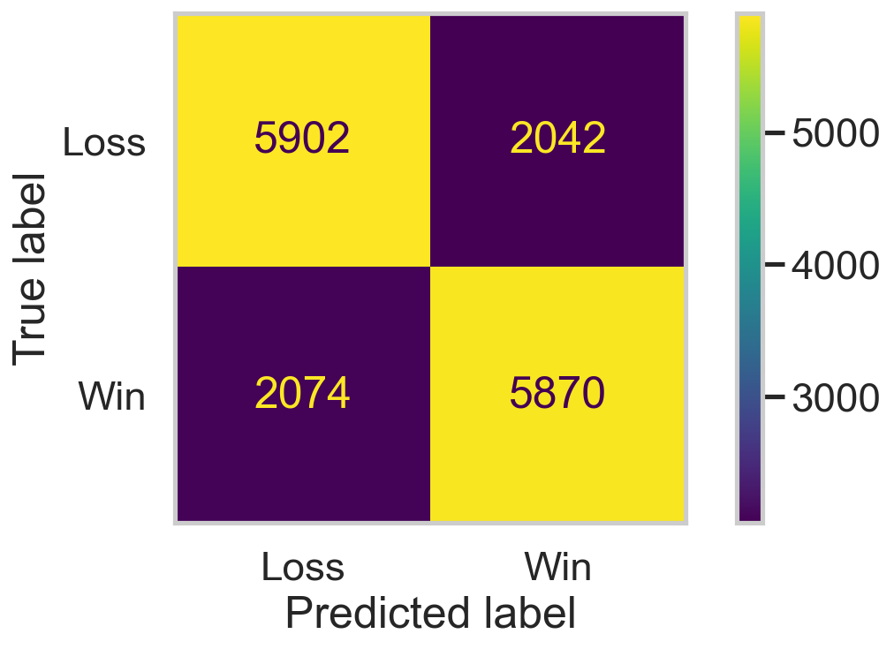

<section id="introduction">
 <h2>Introduction</h2>

 

   Professional League of Legends matches move very quickly. A single game can be decided by a
   handful of key moments in the first 15 minutes way before most fans can tell who's
   actually going to win. Commentators are constantly reading early gold leads, kill counts,
   and objective control to guess at a team's odds, but how much do those early signals
   <em>really</em> tell us?
 

 

   This project uses professional match data from
   <a href="https://oracleselixir.com/" target="_blank" rel="noopener noreferrer">Oracle's Elixir</a>,
   one of the most widely used sources of League of Legends esports statistics, covering the
   2026 competitive season. Each row represents either a players performance or overall team's performance in a single game.
   This means that for every game there are 12 rows (5 players on each team and 2 overall team rows).
 

 

   <strong>The question at the center of this project: Can we predict whether a team will win
   or lose a match using only the information available at the 15-minute mark?</strong>
 

 

   This is important because if early-game stats can reliably predict the outcome of a game as a whole,
   it means the first half of the game effectively decides the match.
   If they can't, it means League of Legends games are more volatile
   than they appear.
 

 

   <strong>Dataset size:</strong> After cleaning, the dataset contains <strong>15888 rows</strong>,
   each representing one team's performance in one professional match.
 

 <h3>Columns used to answer this question</h3>

 <table>
   <thead>
     <tr>
       <th>Column</th>
       <th>What it represents</th>
     </tr>
   </thead>
   <tbody>
     <tr>
       <td><code>result</code> / <code>result_label</code></td>
       <td>Whether the team won or lost the game (what we're trying to predict)</td>
     </tr>
     <tr>
       <td><code>firstPick</code></td>
       <td>Whether the team had first pick during the champion draft</td>
     </tr>
     <tr>
       <td><code>firstblood</code></td>
       <td>Whether the team secured the game's first kill</td>
     </tr>
     <tr>
       <td><code>firstdragon</code></td>
       <td>Whether the team secured the game's first dragon</td>
     </tr>
     <tr>
       <td><code>firstherald</code></td>
       <td>Whether the team secured the game's first Rift Herald</td>
     </tr>
     <tr>
       <td><code>goldat10</code> / <code>goldat15</code></td>
       <td>Team's total gold at 10 and 15 minutes</td>
     </tr>
     <tr>
       <td><code>xpat10</code> / <code>xpat15</code></td>
       <td>Team's total experience at 10 and 15 minutes</td>
     </tr>
     <tr>
       <td><code>csat10</code> / <code>csat15</code></td>
       <td>Team's total creep score (minions + jungle monsters) at 10 and 15 minutes</td>
     </tr>
     <tr>
       <td><code>killsat10</code> / <code>killsat15</code></td>
       <td>Team kills by 10 and 15 minutes</td>
     </tr>
     <tr>
       <td><code>assistsat10</code> / <code>assistsat15</code></td>
       <td>Team assists by 10 and 15 minutes</td>
     </tr>
     <tr>
       <td><code>deathsat10</code> / <code>deathsat15</code></td>
       <td>Team deaths by 10 and 15 minutes</td>
     </tr>
     <tr>
       <td><code>gamelength</code></td>
       <td>Total game length in seconds (used later in the fairness analysis)</td>
     </tr>
   </tbody>
 </table>
</section>
<section id="data-cleaning-and-eda">
  <h2>Data Cleaning and Exploratory Data Analysis</h2>

  <h3>Data Cleaning</h3>

  

    <strong>1. Filtering to team-level rows.</strong> 
    Oracle's Elixir records one row per <em>player</em> per game, plus a separate aggregated
    row per <em>team</em> per game (identified by <code>position == 'team'</code>). Since this
    project is about predicting team outcomes rather than individual performance, I filtered
    down to only the team-level rows:
  

  <pre><code>teams = lol[lol['position'] == 'team'].drop('position', axis=1)</code></pre>
  

    This immediately removes about 5/6 of the raw rows (5 players + 1 team row per team per
    game).
  

  

    <strong>2. Filtering to complete data.</strong> 
    Oracle's Elixir flags each game with a <code>datacompleteness</code> field, since some
    matches are scraped from incomplete broadcast/replay data (missing timestamps, missing
    draft info, etc.). I kept only rows marked <code>'complete'</code>:
  

  <pre><code>teams = teams[teams['datacompleteness'] == 'complete'].drop('datacompleteness', axis=1)</code></pre>
  

    <strong>3. Selecting relevant columns.</strong> 
    The raw dataset has 70+ columns covering everything from bans/picks to full-game damage
    and vision stats. I narrowed this down to the columns relevant to my prediction question.
  

  

    <strong>4. Converting boolean-like columns.</strong> 
    Columns like <code>firstPick</code>, <code>firstblood</code>, <code>firstdragon</code>,
    <code>firstherald</code>, <code>firsttower</code>, <code>firstmidtower</code>, and
    <code>firsttothreetowers</code> are stored as 0/1 floats in the raw CSV but are
    conceptually true/false flags, so I cast them to booleans:
  

  <pre><code>cleaned[[...]] = cleaned[[...]].astype(bool)</code></pre>
  <h3>Cleaned DataFrame</h3>

  
Below is the first few rows of the cleaned dataset:

  

    <table border="1" class="dataframe">
    <thead>
      <tr style="text-align: right;">
        <th></th>
        <th>result</th>
        <th>gameid</th>
        <th>teamname</th>
        <th>firstPick</th>
        <th>gamelength</th>
        <th>kills</th>
        <th>deaths</th>
        <th>assists</th>
        <th>doublekills</th>
        <th>triplekills</th>
        <th>quadrakills</th>
        <th>pentakills</th>
        <th>firstblood</th>
        <th>team kpm</th>
        <th>ckpm</th>
        <th>firstdragon</th>
        <th>dragons</th>
        <th>elders</th>
        <th>firstherald</th>
        <th>heralds</th>
        <th>void_grubs</th>
        <th>barons</th>
        <th>firsttower</th>
        <th>towers</th>
        <th>firstmidtower</th>
        <th>firsttothreetowers</th>
        <th>turretplates</th>
        <th>inhibitors</th>
        <th>damagetochampions</th>
        <th>dpm</th>
        <th>damagetakenperminute</th>
        <th>damagemitigatedperminute</th>
        <th>damagetotowers</th>
        <th>wardsplaced</th>
        <th>wpm</th>
        <th>wardskilled</th>
        <th>wcpm</th>
        <th>controlwardsbought</th>
        <th>visionscore</th>
        <th>vspm</th>
        <th>earned gpm</th>
        <th>goldspent</th>
        <th>gspd</th>
        <th>gpr</th>
        <th>minionkills</th>
        <th>monsterkills</th>
        <th>cspm</th>
        <th>goldat10</th>
        <th>xpat10</th>
        <th>csat10</th>
        <th>killsat10</th>
        <th>assistsat10</th>
        <th>deathsat10</th>
        <th>goldat15</th>
        <th>xpat15</th>
        <th>csat15</th>
        <th>killsat15</th>
        <th>assistsat15</th>
        <th>deathsat15</th>
        <th>goldat20</th>
        <th>xpat20</th>
        <th>csat20</th>
        <th>killsat20</th>
        <th>assistsat20</th>
        <th>deathsat20</th>
        <th>goldat25</th>
        <th>xpat25</th>
        <th>csat25</th>
        <th>killsat25</th>
        <th>assistsat25</th>
        <th>deathsat25</th>
        <th>result_label</th>
      </tr>
    </thead>
    <tbody>
      <tr>
        <th>10</th>
        <td>0</td>
        <td>LOLTMNT05_171038</td>
        <td>GMBLERS Esports</td>
        <td>True</td>
        <td>1756</td>
        <td>22</td>
        <td>29</td>
        <td>28</td>
        <td>1.0</td>
        <td>0.0</td>
        <td>0.0</td>
        <td>0.0</td>
        <td>True</td>
        <td>0.75</td>
        <td>1.74</td>
        <td>True</td>
        <td>3.0</td>
        <td>0.0</td>
        <td>True</td>
        <td>1.0</td>
        <td>3.0</td>
        <td>0.0</td>
        <td>True</td>
        <td>3.0</td>
        <td>True</td>
        <td>True</td>
        <td>22.0</td>
        <td>0.0</td>
        <td>93473</td>
        <td>3193.84</td>
        <td>4230.75</td>
        <td>2944.13</td>
        <td>18382.0</td>
        <td>81</td>
        <td>2.77</td>
        <td>38</td>
        <td>1.30</td>
        <td>12</td>
        <td>241</td>
        <td>8.23</td>
        <td>1270.46</td>
        <td>53361</td>
        <td>-0.02</td>
        <td>-0.18</td>
        <td>707.0</td>
        <td>180</td>
        <td>30.31</td>
        <td>17079.0</td>
        <td>19437.0</td>
        <td>309.0</td>
        <td>5.0</td>
        <td>6.0</td>
        <td>6.0</td>
        <td>29607.0</td>
        <td>32613.0</td>
        <td>482.0</td>
        <td>12.0</td>
        <td>11.0</td>
        <td>13.0</td>
        <td>40952.0</td>
        <td>45397.0</td>
        <td>642.0</td>
        <td>18.0</td>
        <td>20.0</td>
        <td>19.0</td>
        <td>49357.0</td>
        <td>55550.0</td>
        <td>795.0</td>
        <td>20.0</td>
        <td>22.0</td>
        <td>20.0</td>
        <td>Loss</td>
      </tr>
      <tr>
        <th>11</th>
        <td>1</td>
        <td>LOLTMNT05_171038</td>
        <td>EKO Esports</td>
        <td>False</td>
        <td>1756</td>
        <td>29</td>
        <td>22</td>
        <td>51</td>
        <td>5.0</td>
        <td>0.0</td>
        <td>0.0</td>
        <td>0.0</td>
        <td>False</td>
        <td>0.99</td>
        <td>1.74</td>
        <td>False</td>
        <td>1.0</td>
        <td>0.0</td>
        <td>False</td>
        <td>0.0</td>
        <td>0.0</td>
        <td>1.0</td>
        <td>False</td>
        <td>7.0</td>
        <td>False</td>
        <td>False</td>
        <td>26.0</td>
        <td>1.0</td>
        <td>98600</td>
        <td>3369.02</td>
        <td>4119.19</td>
        <td>3755.43</td>
        <td>28875.0</td>
        <td>86</td>
        <td>2.94</td>
        <td>28</td>
        <td>0.96</td>
        <td>17</td>
        <td>220</td>
        <td>7.52</td>
        <td>1464.46</td>
        <td>54200</td>
        <td>0.02</td>
        <td>0.18</td>
        <td>718.0</td>
        <td>203</td>
        <td>31.47</td>
        <td>17617.0</td>
        <td>20161.0</td>
        <td>346.0</td>
        <td>6.0</td>
        <td>2.0</td>
        <td>5.0</td>
        <td>28500.0</td>
        <td>31959.0</td>
        <td>496.0</td>
        <td>13.0</td>
        <td>11.0</td>
        <td>12.0</td>
        <td>38716.0</td>
        <td>45019.0</td>
        <td>648.0</td>
        <td>19.0</td>
        <td>24.0</td>
        <td>18.0</td>
        <td>47602.0</td>
        <td>56563.0</td>
        <td>824.0</td>
        <td>20.0</td>
        <td>26.0</td>
        <td>20.0</td>
        <td>Win</td>
      </tr>
      <tr>
        <th>22</th>
        <td>1</td>
        <td>LOLTMNT05_172024</td>
        <td>Deacoy</td>
        <td>True</td>
        <td>2243</td>
        <td>14</td>
        <td>15</td>
        <td>34</td>
        <td>1.0</td>
        <td>0.0</td>
        <td>0.0</td>
        <td>0.0</td>
        <td>True</td>
        <td>0.37</td>
        <td>0.78</td>
        <td>False</td>
        <td>1.0</td>
        <td>0.0</td>
        <td>True</td>
        <td>1.0</td>
        <td>3.0</td>
        <td>1.0</td>
        <td>True</td>
        <td>10.0</td>
        <td>True</td>
        <td>True</td>
        <td>40.0</td>
        <td>1.0</td>
        <td>134685</td>
        <td>3602.81</td>
        <td>4632.57</td>
        <td>4715.31</td>
        <td>34940.0</td>
        <td>94</td>
        <td>2.51</td>
        <td>50</td>
        <td>1.34</td>
        <td>19</td>
        <td>326</td>
        <td>8.72</td>
        <td>1240.04</td>
        <td>63138</td>
        <td>0.04</td>
        <td>0.67</td>
        <td>1020.0</td>
        <td>259</td>
        <td>34.21</td>
        <td>16659.0</td>
        <td>20787.0</td>
        <td>365.0</td>
        <td>2.0</td>
        <td>2.0</td>
        <td>2.0</td>
        <td>24401.0</td>
        <td>32478.0</td>
        <td>555.0</td>
        <td>2.0</td>
        <td>2.0</td>
        <td>6.0</td>
        <td>33495.0</td>
        <td>45303.0</td>
        <td>773.0</td>
        <td>2.0</td>
        <td>2.0</td>
        <td>7.0</td>
        <td>43609.0</td>
        <td>58120.0</td>
        <td>986.0</td>
        <td>3.0</td>
        <td>4.0</td>
        <td>9.0</td>
        <td>Win</td>
      </tr>
      <tr>
        <th>23</th>
        <td>0</td>
        <td>LOLTMNT05_172024</td>
        <td>Zena Esports</td>
        <td>False</td>
        <td>2243</td>
        <td>15</td>
        <td>14</td>
        <td>32</td>
        <td>1.0</td>
        <td>0.0</td>
        <td>0.0</td>
        <td>0.0</td>
        <td>False</td>
        <td>0.40</td>
        <td>0.78</td>
        <td>True</td>
        <td>4.0</td>
        <td>0.0</td>
        <td>False</td>
        <td>0.0</td>
        <td>0.0</td>
        <td>0.0</td>
        <td>False</td>
        <td>2.0</td>
        <td>False</td>
        <td>False</td>
        <td>15.0</td>
        <td>0.0</td>
        <td>140533</td>
        <td>3759.24</td>
        <td>4234.99</td>
        <td>5020.63</td>
        <td>14396.0</td>
        <td>111</td>
        <td>2.97</td>
        <td>35</td>
        <td>0.94</td>
        <td>14</td>
        <td>303</td>
        <td>8.11</td>
        <td>1052.42</td>
        <td>60818</td>
        <td>-0.04</td>
        <td>-0.67</td>
        <td>920.0</td>
        <td>267</td>
        <td>31.75</td>
        <td>15957.0</td>
        <td>20168.0</td>
        <td>327.0</td>
        <td>2.0</td>
        <td>2.0</td>
        <td>2.0</td>
        <td>25661.0</td>
        <td>34475.0</td>
        <td>522.0</td>
        <td>6.0</td>
        <td>6.0</td>
        <td>2.0</td>
        <td>35112.0</td>
        <td>47753.0</td>
        <td>739.0</td>
        <td>7.0</td>
        <td>7.0</td>
        <td>2.0</td>
        <td>43510.0</td>
        <td>58917.0</td>
        <td>906.0</td>
        <td>9.0</td>
        <td>15.0</td>
        <td>3.0</td>
        <td>Loss</td>
      </tr>
      <tr>
        <th>34</th>
        <td>0</td>
        <td>LOLTMNT05_171043</td>
        <td>Axolotl</td>
        <td>True</td>
        <td>1829</td>
        <td>8</td>
        <td>23</td>
        <td>12</td>
        <td>0.0</td>
        <td>0.0</td>
        <td>0.0</td>
        <td>0.0</td>
        <td>False</td>
        <td>0.26</td>
        <td>1.02</td>
        <td>False</td>
        <td>0.0</td>
        <td>0.0</td>
        <td>True</td>
        <td>1.0</td>
        <td>1.0</td>
        <td>0.0</td>
        <td>True</td>
        <td>5.0</td>
        <td>True</td>
        <td>True</td>
        <td>32.0</td>
        <td>0.0</td>
        <td>78802</td>
        <td>2585.08</td>
        <td>3275.59</td>
        <td>3745.39</td>
        <td>30180.0</td>
        <td>98</td>
        <td>3.21</td>
        <td>36</td>
        <td>1.18</td>
        <td>20</td>
        <td>254</td>
        <td>8.33</td>
        <td>1112.90</td>
        <td>49165</td>
        <td>-0.13</td>
        <td>-0.52</td>
        <td>820.0</td>
        <td>182</td>
        <td>32.87</td>
        <td>16097.0</td>
        <td>19344.0</td>
        <td>327.0</td>
        <td>2.0</td>
        <td>5.0</td>
        <td>5.0</td>
        <td>26963.0</td>
        <td>33030.0</td>
        <td>518.0</td>
        <td>6.0</td>
        <td>8.0</td>
        <td>9.0</td>
        <td>35962.0</td>
        <td>43496.0</td>
        <td>688.0</td>
        <td>7.0</td>
        <td>11.0</td>
        <td>9.0</td>
        <td>44694.0</td>
        <td>53434.0</td>
        <td>866.0</td>
        <td>8.0</td>
        <td>12.0</td>
        <td>14.0</td>
        <td>Loss</td>
      </tr>
    </tbody>
  </table>

</section>
<section id="gold-distribution">
  <h3>Distribution of Gold at 15 Minutes</h3>

  <iframe
  src="assets/gold-at-15-distribution.html"
  width="800"
  height="600"
  frameborder="0"
></iframe>

  

    The distribution of team gold at 15 minutes is roughly normal and centered around
    typical professional-game gold totals, with a slight right skew. This shows a small number of teams
    build unusually large early gold leads, while most teams cluster closer to an even, average gold total at
    this point in the game.
  

</section>
<section id="firstblood-kills-relationship">
  <h3>Total Kills by First Blood Status</h3>

  <iframe
    src="assets/firstblood-kills.html"
    width="800"
    height="600"
    frameborder="0">
  </iframe>

  

    Teams that secure first blood tend to finish the game with a higher median total kill
    count than teams that don't, suggesting that winning the opening skirmish often sets the
    tone for a more aggressive, kill-heavy game overall rather than being an isolated early
    event.
  

</section>
<section id="grouped-gold-stats">
  <h3>Gold Statistics by Game Outcome</h3>

  

    <table border="1" class="dataframe">
  <thead>
    <tr>
      <th></th>
      <th colspan="3" halign="left">goldat10</th>
      <th colspan="3" halign="left">goldat15</th>
      <th colspan="3" halign="left">goldat20</th>
      <th colspan="3" halign="left">goldat25</th>
    </tr>
    <tr>
      <th></th>
      <th>mean</th>
      <th>median</th>
      <th>std</th>
      <th>mean</th>
      <th>median</th>
      <th>std</th>
      <th>mean</th>
      <th>median</th>
      <th>std</th>
      <th>mean</th>
      <th>median</th>
      <th>std</th>
    </tr>
    <tr>
      <th>result_label</th>
      <th></th>
      <th></th>
      <th></th>
      <th></th>
      <th></th>
      <th></th>
      <th></th>
      <th></th>
      <th></th>
      <th></th>
      <th></th>
      <th></th>
    </tr>
  </thead>
  <tbody>
    <tr>
      <th>Loss</th>
      <td>16646.39</td>
      <td>16611.5</td>
      <td>853.72</td>
      <td>25791.61</td>
      <td>25724.0</td>
      <td>1449.93</td>
      <td>35473.84</td>
      <td>35371.0</td>
      <td>2073.66</td>
      <td>44766.14</td>
      <td>44608.5</td>
      <td>2637.98</td>
    </tr>
    <tr>
      <th>Win</th>
      <td>17366.73</td>
      <td>17260.0</td>
      <td>1001.33</td>
      <td>27503.09</td>
      <td>27261.0</td>
      <td>1850.45</td>
      <td>38620.10</td>
      <td>38297.0</td>
      <td>2812.21</td>
      <td>49540.64</td>
      <td>49188.0</td>
      <td>3673.77</td>
    </tr>
  </tbody>
</table>
  

  

    This table breaks down the mean, median, and standard deviation of team gold at 10, 15,
    20, and 25 minutes, separately for winning and losing teams. The gap between winning and
    losing teams' average gold widens at each successive time stamp, suggesting that gold
    leads tend to snowball over the course of a game rather than staying constant. An early
    advantage tends to compound into an even larger one by the 25-minute mark. The standard
    deviations also grow over time for both groups, reflecting the fact that games become more
    variable the longer they go on, since more time allows for both bigger blowouts and bigger
    comebacks.
  

</section>
<section id="assessment-of-missingness">
  <h2>Assessment of Missingness</h2>

  <h3>Are any columns MNAR?</h3>

  

    Based on my analysis, I do <strong>not</strong> believe any column in my dataset is Missing Not At Random (<strong>MNAR</strong>). 
    The only columns with missing data were minionkills, cspm, and gold/xp/kills/assists/deaths at 20 and 25 min. 
    For gold/xp/kills/assists/deaths, they are missing by design since some games do not last 20 or 25 minutes so the
    respective columns would not have any data. For minionkills and cspm, these could be MNAR but in order to find out
    I would have to perform a permutation test to show that its missingness is not dependent on any other column.
  

  
  

    Rows with minionkills missing had cspm missing as well which is why I will only perform one permutation test on cspm. 
    Either column would have worked though. 

</section>
<section id="missingness-permutation-tests">
  <h3>Permutation Test Results</h3>

  

    To assess the missingness mechanism of <code>cspm</code>, I ran permutation tests
    comparing the distribution of other columns between rows where <code>cspm</code> is
    missing and rows where it is not missing.
  

  

    <strong>Test 1: Does <code>cspm</code> missingness depend on <code>gamelength</code>?</strong> 
    <strong>Null Hypothesis:</strong> The missingness of <code>cspm</code> does not depend on
    <code>gamelength</code>; any observed difference in mean game length between the two
    groups is due to random chance. 
    <strong>Alternative Hypothesis:</strong> The missingness of <code>cspm</code> does depend
    on <code>gamelength</code>.
  

  

    Using the difference in mean <code>gamelength</code> between the missing and non-missing
    groups as my test statistic, I observed a difference of <strong>56.190 seconds</strong>,
    and a permutation test (1,000 repetitions) produced a p-value of <strong>0.0010</strong>.
    Since this p-value is well below 0.05, I <strong>reject the null hypothesis</strong>
  

  <iframe
    src="assets/missing.html"
    width="600"
    height="600"
    frameborder="0">
  </iframe>

  

    The plot above shows the empirical distribution of the permuted test statistic (the
    difference in mean game length between the two groups under random shuffling), with the
    observed difference marked in red. The observed value falls far outside the bulk of the
    null distribution.
  

  

    <strong>Interpretation with respect to my question:</strong> Because <code>cspm</code>'s
    missingness is explainable by an observed column (<code>gamelength</code>) rather than
    being purely random or tied to the unobserved CS value itself, this is evidence of MAR, not
    MCAR or MNAR.
  

</section>
<section id="hypothesis-testing">
  <h2>Hypothesis Testing</h2>

  <h3>Question: Does gold at 15 minutes influence win rate?</h3>

  

    <strong>Null Hypothesis:</strong> There is no difference in mean gold at 15 minutes
    between teams that win and teams that lose. Any observed difference is due to random
    chance.
  

  

    <strong>Alternative Hypothesis:</strong> Teams that win have a higher mean gold at 15
    minutes than teams that lose.
  

  

    <strong>Test statistic:</strong> Difference in means (mean <code>goldat15</code> for
    winning teams minus mean <code>goldat15</code> for losing teams). I chose this statistic
    because it directly captures the quantity my hypothesis is about. It is a signed difference in
    average gold. Since my alternative hypothesis is directional (winners have <em>higher</em> gold, not just
    <em>different</em> gold), a signed test statistic lets me run a one-sided test, which
    matches the actual claim I'm testing.
  

  

    <strong>Significance level:</strong> I used the standard threshold of
    <strong>α = 0.05</strong>
  

  

    <strong>Method:</strong> I ran a permutation test with 10,000 repetitions, shuffling the
    <code>result</code> labels and recomputing the difference in mean <code>goldat15</code>
    between the two (now randomly assigned) groups each time. This builds an empirical null
    distribution representing what the test statistic would look like if win/loss had no
    real relationship to gold at 15 minutes.
  

  

    <strong>Result:</strong> The observed difference in mean gold at 15 minutes (Win − Loss)
    was <strong>1711.48</strong>, and the resulting p-value was
    <strong>0.00000</strong>.
  

  

    <strong>Conclusion:</strong> Since the p-value is far below my significance level of 0.05,
    I <strong>reject the null hypothesis</strong> in favor of the alternative that winning teams have 
    a higher average gold at 15 minutes than losing teams
  

  

    <strong>Why these choices are appropriate:</strong> A permutation test is good here
    because we are trying to see if they come from the same distribution or not. Using the raw difference in
    means as the test statistic is both interpretable and directly
    aligned with the direction specified in my alternative hypothesis, making the one-sided
    p-value a faithful measure of the specific claim I set out to test. It also gives an example of how 
    gold at 15 minutes is a feature that can help predict the overall outcome of the game.
  

  <iframe
    src="assets/gold-dist.html"
    width="600"
    height="600"
    frameborder="0">
  </iframe>
  

    This plot is showing the two distributions of gold at 15 minutes among losing and winning teams. As you can see the winning
    team has a different distribution that is more to the right.
  

</section>
<section id="framing-a-prediction-problem">
  <h2>Framing a Prediction Problem</h2>

  

    <strong>Prediction problem:</strong> Given a team's in-game statistics at the 15-minute
    mark, predict whether that team will ultimately <strong>win or lose</strong> the match.
  

  

    <strong>Type:</strong> This is a <strong>classification</strong> problem specifically,
    <strong>binary classification</strong>, since there are only two possible outcomes for a
    team in a completed League of Legends match: win or lose.
  

  

    <strong>Response variable:</strong> <code>result</code> (equivalently, <code>result_label</code>,
    its human-readable "Win"/"Loss" version). I chose this as my response variable because it's
    the direct target of my central research question. I want to know whether a team's
    eventual outcome can be predicted from its early-game state, and <code>result</code> is
    exactly that outcome, recorded for every game in the dataset.
  

  

    <strong>Features used at "time of prediction":</strong> All of my features are restricted
    to information that would genuinely be known by the 15-minute mark of a live game
    (e.g., <code>goldat10</code>, <code>goldat15</code>, <code>killsat10</code>,
    <code>killsat15</code>, <code>firstblood</code>, <code>firstdragon</code>, etc.). I
    deliberately excluded any full-game or post-game statistics (like final <code>kills</code>,
    <code>towers</code>, or <code>damagetochampions</code>), since those are only known after
    the game ends and would leak information about the outcome I'm trying to predict.
  

  

    <strong>Evaluation metric:</strong> I used <strong>accuracy</strong> as my primary
    evaluation metric, since the two outcome classes (win/loss) are naturally
    <strong>balanced</strong>. Every game has exactly one winner and one loser, so the dataset
    contains roughly equal numbers of each class by construction.
  

</section>
<section id="baseline-model">
  <h2>Baseline Model</h2>

  

    My baseline model is a <strong>Decision Tree Classifier</strong> with
    <code>max_depth=5</code> and <code>criterion='entropy'</code>, predicting whether a team
    wins or loses (<code>result_label</code>) using only information available at or before the
    15-minute mark of the game.
  

  <h3>Features</h3>

  <table>
    <thead>
      <tr>
        <th>Feature</th>
        <th>Type</th>
      </tr>
    </thead>
    <tbody>
      <tr><td><code>firstPick</code></td><td>Nominal (binary: had first pick or not)</td></tr>
      <tr><td><code>firstblood</code></td><td>Nominal (binary: secured first blood or not)</td></tr>
      <tr><td><code>firstdragon</code></td><td>Nominal (binary: secured first dragon or not)</td></tr>
      <tr><td><code>firstherald</code></td><td>Nominal (binary: secured first herald or not)</td></tr>
      <tr><td><code>goldat10</code></td><td>Quantitative</td></tr>
      <tr><td><code>xpat10</code></td><td>Quantitative</td></tr>
      <tr><td><code>csat10</code></td><td>Quantitative</td></tr>
      <tr><td><code>killsat10</code></td><td>Quantitative</td></tr>
      <tr><td><code>assistsat10</code></td><td>Quantitative</td></tr>
      <tr><td><code>deathsat10</code></td><td>Quantitative</td></tr>
      <tr><td><code>goldat15</code></td><td>Quantitative</td></tr>
      <tr><td><code>xpat15</code></td><td>Quantitative</td></tr>
      <tr><td><code>csat15</code></td><td>Quantitative</td></tr>
      <tr><td><code>killsat15</code></td><td>Quantitative</td></tr>
      <tr><td><code>assistsat15</code></td><td>Quantitative</td></tr>
      <tr><td><code>deathsat15</code></td><td>Quantitative</td></tr>
    </tbody>
  </table>

  

    In total, the model uses <strong>16 features</strong>: 4 nominal (binary) "first ___" flags
    and 12 quantitative early-game statistics captured at the 10- and 15-minute marks.
  

  <h3>Performance</h3>

  

    The baseline model achieved a <strong>training accuracy of 0.741</strong> and a
    <strong>test accuracy of 0.714</strong>.
  

  <h3>Is this a "good" model?</h3>

  

    I believe this baseline model is a good model. Since we are predicting win/loss and 
    there is an even number of each in the dataset, any accuracy percantage significantly larger than
    50% (which would be guessing or all win/all loss) has reasonable predicting power. Although I think 
    that it can get better.
  

</section>
<section id="final-model">
  <h2>Final Model</h2>

  <h3>Engineered Features</h3>

  

    In addition to the raw features from my baseline model, I engineered two new features:
    <code>kdaat10</code> and <code>kdaat15</code>, computed as
    <code>(kills + assists) / max(deaths, 1)</code> at the 10- and 15-minute marks.
  

  

    I believe these features are well-suited to the data generating process because KDA is a
    <strong>single, well-established summary statistic</strong> that everyone already uses
    to judge a player or team's combat performance. A decision tree can only split on
    one raw feature at a time, so to approximate "this team is winning fights efficiently," it
    would otherwise need to chain together several separate splits across <code>kills</code>,
    <code>assists</code>, and <code>deaths</code> independently. By directly providing the
    ratio, I'm handing the model a feature that more closely mirrors how the underlying game
    state actually translates into an advantage: a team with a high KDA is one that is
    consistently winning fights without giving up equivalent value in return, and that
    kind of efficient aggression is a natural predictor of snowballing into a game-winning lead.
  

  <h3>Modeling Algorithms Considered</h3>

  

    I compared three modeling algorithms: a <strong>Decision Tree Classifier</strong>, a
    <strong>Logistic Regression</strong> model, and a <strong>K-Nearest Neighbors
    Classifier</strong>. For DTC and KNN, I built a <code>Pipeline</code> that computed the engineered
    KDA features via a <code>ColumnTransformer</code> (and, for logistic regression and KNN,
    applied <code>StandardScaler</code> to all quantitative features, since both of these
    algorithms are scale-sensitive, unlike decision trees). I chose not to include KDA for logistic regression 
    because it could have multicollinearity with other features.
  

  <h3>Hyperparameter Selection</h3>

  

    For each algorithm, I used <strong><code>GridSearchCV</code> with 5-fold
    cross-validation</strong> to search over a grid of candidate hyperparameters and select the
    combination that maximized cross-validated accuracy on the training set:
  

  <ul>
    <li>
      <strong>Decision Tree:</strong> searched over <code>max_depth</code>,
      <code>criterion</code>, <code>min_samples_split</code>, and <code>min_samples_leaf</code>.
    </li>
    <li>
      <strong>Logistic Regression:</strong> searched over <code>C</code> (regularization
      strength), <code>penalty</code>, and <code>solver</code>.
    </li>
    <li>
      <strong>K-Nearest Neighbors:</strong> searched over <code>n_neighbors</code>,
      <code>weights</code>, and <code>metric</code>.
    </li>
  </ul>

  

    I then compared each algorithm's best cross-validated accuracy and held-out test accuracy,
    and selected <strong>Logistic Regression</strong> as my final model, since it achieved the
    highest test accuracy among the three.
  

  

    <strong>Best hyperparameters found:</strong> <code>C=0.01</code>, <code>penalty='l2'</code>,
    <code>solver='saga'</code>.
  

  

    A small <code>C</code> value (0.01) corresponds to <strong>strong regularization</strong>,
    which shrinks the model's coefficients toward zero. This makes sense given the data
    generating process: several of my features (e.g., <code>goldat15</code> and
    <code>xpat15</code> are naturally
    correlated with one another, since gold, experience, and combat stats all tend to move
    together as a team accumulates an early advantage. Strong regularization helps the model
    avoid over-relying on any single one of these highly correlated signals and instead spreads the
    weight across them, which should generalize better to new games rather
    than fitting noise specific to the training set.
  

  <h3>Improvement Over Baseline</h3>

  

    My baseline decision tree (<code>max_depth=5</code>, <code>criterion='entropy'</code>,
    untuned) achieved a test accuracy of <strong>0.714</strong>. My final,
    tuned logistic regression model achieved a test accuracy of
    <strong>0.741</strong>, an improvement of roughly
    <strong>3</strong> percentage points. This improvement reflects two combined
    changes: (1) searching for well-tuned hyperparameters via cross-validation,
    and (2) adding the engineered KDA features/standardizing.
  

  
</section>
<section id="fairness-analysis">
  <h2>Fairness Analysis</h2>

  <h3>Group Choice</h3>

  

    <strong>Group X: Short games</strong> — teams whose <code>gamelength</code> is at or below
    the average game length in the dataset. 
    <strong>Group Y: Long games</strong> — teams whose <code>gamelength</code> is above the
    average game length.
  

  <h3>Evaluation Metric</h3>

  

    I used <strong>precision</strong> (for predicting the <code>'Win'</code> class), since this
    is a binary classification task and precision directly answers a fairness-relevant
    question: of the teams my model predicts will win, how often is it actually correct,
    <em>and does that reliability differ between short and long games?</em>
  

  <h3>Hypotheses</h3>

  

    <strong>Null Hypothesis:</strong> My model is fair. Its precision for teams in short games
    and teams in long games is roughly the same.
  

  

    <strong>Alternative Hypothesis:</strong> My model is unfair. Its precision for teams in
    long games is lower than its precision for teams in short games.
  

  

    This is a <strong>one-sided</strong> alternative, motivated by the idea that a 15-minute
    lead is a noisier predictor of the final outcome the longer a game continues.
  

  <h3>Test Statistic and Significance Level</h3>

  

    <strong>Test statistic:</strong> the difference in precision between the two groups
    (PrecisionShort − PrecisionLong). This directly matches the direction
    specified in my alternative hypothesis, so a large positive value provides evidence in
    favor of the alternative.
  

  

    <strong>Significance level:</strong> α = 0.05, the standard threshold.
  

  

    <strong>Method:</strong> Using my final fitted model's predictions (the model itself was
    not modified or refit), I computed the observed precision for each group, then ran a
    permutation test with 1,000 repetitions, randomly shuffling the short/long group labels
    each time and recomputing the precision difference to build an empirical null distribution.
  

  <h3>Results</h3>

  

    <strong>Precision (Short games):</strong> 0.8565 
    <strong>Precision (Long games):</strong> 0.6054 
    <strong>Observed difference (Short − Long):</strong> 0.2512 
    <strong>P-value:</strong> 0.0010
  

  <iframe
    src="assets/fairness-precision-permutation.html"
    width="600"
    height="600"
    frameborder="0">
  </iframe>
  
  

    This plot shows how far the p-value is from the distribution.
  

  <h3>Conclusion</h3>

  

    [If p_value &lt; 0.05:] Since the p-value is below my significance level of 0.05, I
    <strong>reject the null hypothesis</strong>. There is a high chance that my 
    model's precision is lower for teams in long games than for teams in short games,
    supporting the idea that early-game (15-minute) statistics are a less reliable
    predictor of the final outcome the longer a game continues.
  

</section>